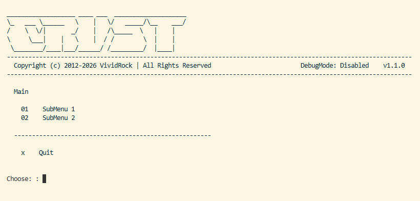

  
 

# Crust - A PowerShell CLI Menu Framework

[![Contributors][contributors-shield]][contributors-url]
[![Forks][forks-shield]][forks-url]
[![Stargazers][stars-shield]][stars-url]
[![Issues][issues-shield]][issues-url]
[![License][license-shield]][license-url]

## Table of Contents

- [Crust - A PowerShell CLI Menu Framework](#crust---a-powershell-cli-menu-framework)
  - [Table of Contents](#table-of-contents)
  - [About](#about)
    - [Features](#features)
    - [Tech Stack](#tech-stack)
    - [Screenshots](#screenshots)
  - [Getting Started](#getting-started)
    - [Prerequisites](#prerequisites)
    - [Installation](#installation)
  - [Usage](#usage)
  - [Roadmap](#roadmap)
  - [Release History](#release-history)
  - [Contribution](#contribution)
    - [Top contributors:](#top-contributors)
  - [License](#license)
  - [Acknowledgments](#acknowledgments)

 

## About

Crust is a simple, elegant solution for adding a retro stylized, traversable, menu-driven interface to your PowerShell scripts, toolsets, and applications.

### Features

- Simple, scalable framework
- Can be easily integrated into any project or toolset
- Language localizing feature that discovers the user's UI culture of PowerShell and then loads the matching json file with language localized content

### Tech Stack

This framework utilizes the following languages and applications:

[![PowerShell][PowerShell]][powershell-url]

### Screenshots

  

    
  

   

This shows the main menu with a sample menu structure.

(<a href="#readme-top">back to top</a>)

## Getting Started

Use the following section to learn how to start using the Crust framework to build your project's next CLI menu.

### Prerequisites

| Prerequisite    | Version |
|-----------------|---------|
| PowerShell      | >= 5.1  |

### Installation

To utilize within your scripts and applications, you need the following folders and files

> Note: The folders need to maintain their relative location to the main controller script.

- configs
- lang
- modules
- crust.ps1
- LICENSE
- README.md

(<a href="#readme-top">back to top</a>)

## Usage

The script provides a single parameter for explicitly defining the PSUICulture value if don't want to autodetect it.

_For more examples, please refer to the [Documentation](https://github.com/VividRock/Crust/tree/main/docs)_

(<a href="#readme-top">back to top</a>)

## Roadmap

- [X] Convert old code to official project

_For a full list of proposed features and issues, please refer to the [Issues](https://github.com/VividRock/Crust/issues)_

(<a href="#readme-top">back to top</a>)

## Release History

This provides a brief review of the last two releases and an overview of their changes.

| Release | Codename  | Date        | Contributor(s)  | Brief Description | Status  |
|---------|-----------|-------------|-----------------|-------------------|---------|
| 1.0.0   | Anorthose | 2026-03-02  | Dustin Estes    | Initial creation of the official Crust project. Migrated the project out of an old GitHub repo and updated all content to improve logic, formatting, etc. Created branding. | Supported |

_For a detailed list of all changes, please refer to the [Releases](https://github.com/VividRock/Crust/releases)_

(<a href="#readme-top">back to top</a>)

## Contribution

If you have a suggestion that would make this better, please fork the repo and create a pull request. You can also simply open an issue with the tag "enhancement".

1. Fork the Project
2. Create your Feature Branch (`git checkout -b feature/FeatureName`)
3. Commit your Changes (`git commit -m 'Add some FeatureName'`)
4. Push to the Branch (`git push origin feature/FeatureName`)
5. Open a Pull Request

### Top contributors:

 

(<a href="#readme-top">back to top</a>)

## License

Copyright (C) VividRock LLC - All Rights Reserved

(<a href="#readme-top">back to top</a>)

## Acknowledgments

Any special acknowledgements or recognitions that contributed to the success of this project.

- None

(<a href="#readme-top">back to top</a>)

<!-- MARKDOWN LINKS & IMAGES -->
<!-- https://www.markdownguide.org/basic-syntax/#reference-style-links -->
[contributors-shield]: https://img.shields.io/github/contributors/VividRock/Crust.svg?style=for-the-badge
[contributors-url]: https://github.com/VividRock/Crust/graphs/contributors
[forks-shield]: https://img.shields.io/github/forks/VividRock/Crust.svg?style=for-the-badge
[forks-url]: https://github.com/VividRock/Crust/network/members
[stars-shield]: https://img.shields.io/github/stars/VividRock/Crust.svg?style=for-the-badge
[stars-url]: https://github.com/VividRock/Crust/stargazers
[issues-shield]: https://img.shields.io/github/issues/VividRock/Crust.svg?style=for-the-badge
[issues-url]: https://github.com/VividRock/Crust/issues
[license-shield]: https://img.shields.io/github/license/VividRock/Crust.svg?style=for-the-badge
[license-url]: https://github.com/VividRock/Crust/blob/master/LICENSE
[product-screenshot]: images/screenshot.png
[PowerShell]: https://img.shields.io/badge/PowerShell-%235391FE.svg?style=for-the-badge&logo=powershell&logoColor=white
[PowerShell-url]: https://learn.microsoft.com/en-us/powershell/
